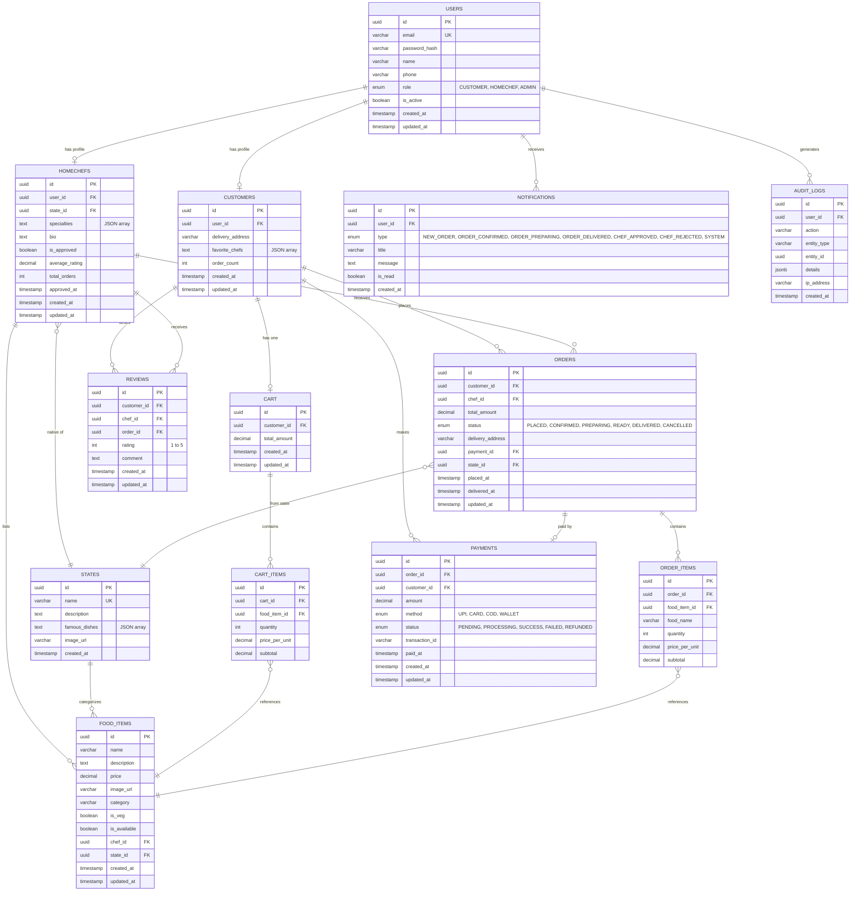

# ER Diagram — Maakhana Food

## Overview
This Entity-Relationship diagram shows the database schema for the Maakhana Food platform. All tables, columns, types, and relationships are defined below.

---

---

## Table Summary
| Table            | Description                                                              | Key Relationships                           |
|------------------|--------------------------------------------------------------------------|---------------------------------------------|
| `USERS`          | All platform users (customers, home chefs, admins)                       | → Customer, HomeChef, Notifications          |
| `CUSTOMERS`      | Customer-specific profile data (extends User)                            | ← User (1:1), → Cart, Orders, Reviews       |
| `HOMECHEFS`      | Chef-specific profile with state, approval status                        | ← User (1:1), → FoodItems, Orders, Reviews  |
| `STATES`         | Indian states (e.g., Punjab, Tamil Nadu, West Bengal)                    | → FoodItems, HomeChefs                        |
| `FOOD_ITEMS`     | Food listings by home chefs with pricing and availability                | ← HomeChef, State                             |
| `ORDERS`         | Customer orders with status and delivery info                            | ← Customer, Chef → OrderItems, Payment       |
| `ORDER_ITEMS`    | Individual items within an order with quantity and pricing                | ← Order, → FoodItem                          |
| `CART`           | Shopping cart per customer                                               | ← Customer (1:1), → CartItems                |
| `CART_ITEMS`     | Items in the cart referencing food items                                  | ← Cart, → FoodItem                           |
| `PAYMENTS`       | Payment records for orders with method and status                        | ← Order (1:1), Customer                      |
| `REVIEWS`        | Customer ratings and reviews for chefs (one per order)                   | ← Customer, Chef, Order                      |
| `NOTIFICATIONS`  | In-app notifications for all user events                                 | ← User                                       |
| `AUDIT_LOGS`     | Tamper-proof log of all system actions for compliance                     | ← User                                       |

---

## Key Indexes
| Table          | Index                                    | Purpose                              |
|----------------|------------------------------------------|--------------------------------------|
| `FOOD_ITEMS`   | `(state_id, is_available)`               | Fast state-based food browsing       |
| `FOOD_ITEMS`   | `(chef_id, is_available)`                | Chef's active food listings          |
| `ORDERS`       | `(customer_id, status)`                  | Customer order history               |
| `ORDERS`       | `(chef_id, status)`                      | Chef incoming orders                 |
| `HOMECHEFS`    | `(state_id, is_approved)`                | Find approved chefs by state         |
| `REVIEWS`      | `(chef_id, rating)`                      | Chef rating aggregation              |
| `NOTIFICATIONS`| `(user_id, is_read)`                     | Unread notification count            |
| `AUDIT_LOGS`   | `(entity_type, entity_id)`               | Entity audit trail lookup            |
| `PAYMENTS`     | `(order_id, status)`                     | Payment status lookup                |
