```mermaid
classDiagram
    direction TB

    %% ===== DOMAIN MODELS =====

    class User {
        <<abstract>>
        -id: string
        -email: string
        -passwordHash: string
        -name: string
        -phone: string
        -role: UserRole
        -isActive: boolean
        -createdAt: Date
        -updatedAt: Date
        +getProfile(): UserProfile
        +updateProfile(dto: UpdateProfileDto): void
        +deactivate(): void
        +authenticate(password: string): boolean
    }

    class UserRole {
        <<enumeration>>
        CUSTOMER
        HOMECHEF
        ADMIN
    }

    class Customer {
        -deliveryAddress: string
        -favoriteChefs: string[]
        -orderCount: number
        +browseFood(region: string): FoodItem[]
        +addToCart(foodItemId: string, qty: number): Cart
        +placeOrder(cartId: string, address: string): Order
        +rateChef(chefId: string, rating: number, review: string): Review
        +getOrderHistory(): Order[]
    }

    class HomeChef {
        -region: string
        -specialties: string[]
        -bio: string
        -isApproved: boolean
        -averageRating: number
        -totalOrders: number
        +addFoodItem(dto: CreateFoodDto): FoodItem
        +updateFoodItem(id: string, dto: UpdateFoodDto): FoodItem
        +deleteFoodItem(id: string): void
        +viewIncomingOrders(): Order[]
        +updateOrderStatus(orderId: string, status: OrderStatus): void
        +getChefStats(): ChefStats
    }

    class Admin {
        -permissions: string[]
        +approveChef(chefId: string): void
        +rejectChef(chefId: string, reason: string): void
        +manageUsers(): User[]
        +monitorOrders(): Order[]
        +viewAnalytics(): PlatformStats
        +deactivateUser(userId: string): void
    }

    class Region {
        -id: string
        -name: string
        -description: string
        -famousDishes: string[]
        -imageUrl: string
        +getFoodItems(): FoodItem[]
        +getChefs(): HomeChef[]
        +getFoodCount(): number
    }

    class FoodItem {
        -id: string
        -name: string
        -description: string
        -price: number
        -imageUrl: string
        -category: string
        -isVeg: boolean
        -isAvailable: boolean
        -chefId: string
        -regionId: string
        -createdAt: Date
        -updatedAt: Date
        +updateDetails(dto: UpdateFoodDto): void
        +toggleAvailability(): void
        +getChef(): HomeChef
        +getRegion(): Region
    }

    class Cart {
        -id: string
        -customerId: string
        -items: CartItem[]
        -totalAmount: number
        -createdAt: Date
        -updatedAt: Date
        +addItem(foodItemId: string, qty: number): void
        +removeItem(foodItemId: string): void
        +updateQuantity(foodItemId: string, qty: number): void
        +calculateTotal(): number
        +clear(): void
        +getItemCount(): number
    }

    class CartItem {
        -foodItemId: string
        -foodName: string
        -quantity: number
        -pricePerUnit: number
        -subtotal: number
    }

    class Order {
        -id: string
        -customerId: string
        -chefId: string
        -items: OrderItem[]
        -totalAmount: number
        -status: OrderStatus
        -deliveryAddress: string
        -paymentId: string
        -regionId: string
        -placedAt: Date
        -deliveredAt: Date
        -updatedAt: Date
        +updateStatus(status: OrderStatus): void
        +cancel(): void
        +getRegionHandler(): OrderRegionHandler
        +isDelivered(): boolean
        +calculateTotal(): number
    }

    class OrderItem {
        -foodItemId: string
        -foodName: string
        -quantity: number
        -pricePerUnit: number
        -subtotal: number
    }

    class OrderStatus {
        <<enumeration>>
        PLACED
        CONFIRMED
        PREPARING
        READY
        DELIVERED
        CANCELLED
    }

    class Review {
        -id: string
        -customerId: string
        -chefId: string
        -orderId: string
        -rating: number
        -comment: string
        -createdAt: Date
        +update(rating: number, comment: string): void
    }

    %% ===== SERVICE LAYER =====

    class AuthService {
        -userRepo: IUserRepository
        -jwtSecret: string
        +register(dto: RegisterDto): User
        +login(email: string, password: string): AuthToken
        +validateToken(token: string): TokenPayload
        +hashPassword(password: string): string
    }

    class FoodService {
        -foodRepo: IFoodRepository
        -stateRepo: IRegionRepository
        +addFoodItem(chefId: string, dto: CreateFoodDto): FoodItem
        +updateFoodItem(id: string, dto: UpdateFoodDto): FoodItem
        +deleteFoodItem(id: string): void
        +findByRegion(region: string): FoodItem[]
        +searchFood(query: string): FoodItem[]
    }

    class OrderService {
        -orderRepo: IOrderRepository
        -cartService: CartService
        -validationChain: OrderValidator
        +createOrder(dto: CreateOrderDto): Order
        +updateOrderStatus(orderId: string, status: OrderStatus): void
        +cancelOrder(orderId: string): void
        +getOrdersByCustomer(customerId: string): Order[]
        +getOrdersByChef(chefId: string): Order[]
    }

    class CartService {
        -cartRepo: ICartRepository
        +getCart(customerId: string): Cart
        +addToCart(customerId: string, foodItemId: string, qty: number): Cart
        +removeFromCart(customerId: string, foodItemId: string): Cart
        +clearCart(customerId: string): void
    }

    class ReviewService {
        -reviewRepo: IReviewRepository
        +addReview(dto: CreateReviewDto): Review
        +getReviewsByChef(chefId: string): Review[]
        +calculateAverageRating(chefId: string): number
    }

    %% ===== VALIDATION CHAIN =====

    class OrderValidator {
        <<abstract>>
        #next: OrderValidator
        +setNext(validator: OrderValidator): OrderValidator
        +validate(order: Order): ValidationResult
        #doValidate(order: Order): ValidationResult*
    }

    class CartNotEmptyValidator {
        #doValidate(order: Order): ValidationResult
    }

    class ItemsAvailableValidator {
        #doValidate(order: Order): ValidationResult
    }

    class AddressValidator {
        #doValidate(order: Order): ValidationResult
    }

    class ChefActiveValidator {
        #doValidate(order: Order): ValidationResult
    }

    %% ===== REPOSITORY INTERFACES =====

    class IUserRepository {
        <<interface>>
        +findById(id: string): User
        +findByEmail(email: string): User
        +save(user: User): User
        +update(user: User): void
        +findByRole(role: UserRole): User[]
    }

    class IFoodRepository {
        <<interface>>
        +findById(id: string): FoodItem
        +findByChef(chefId: string): FoodItem[]
        +findByRegion(region: string): FoodItem[]
        +save(food: FoodItem): FoodItem
        +update(food: FoodItem): void
        +delete(id: string): void
    }

    class IOrderRepository {
        <<interface>>
        +findById(id: string): Order
        +findByCustomer(customerId: string): Order[]
        +findByChef(chefId: string): Order[]
        +save(order: Order): Order
        +update(order: Order): void
    }

    class IRegionRepository {
        <<interface>>
        +findAll(): Region[]
        +findByName(name: string): Region
        +findById(id: string): Region
    }

    class ICartRepository {
        <<interface>>
        +findByCustomer(customerId: string): Cart
        +save(cart: Cart): Cart
        +update(cart: Cart): void
        +delete(customerId: string): void
    }


    class IReviewRepository {
        <<interface>>
        +findByChef(chefId: string): Review[]
        +findByCustomer(customerId: string): Review[]
        +save(review: Review): Review
    }

    %% ===== RELATIONSHIPS =====

    User <|-- Customer : extends
    User <|-- HomeChef : extends
    User <|-- Admin : extends
    User --> UserRole

    Customer "1" --> "1" Cart : has
    Customer "1" --> "*" Order : places
    Customer "1" --> "*" Review : writes

    HomeChef "1" --> "*" FoodItem : lists
    HomeChef "1" --> "*" Order : receives
    HomeChef "1" --> "*" Review : receives

    Region "1" --> "*" FoodItem : categorizes
    Region "1" --> "*" HomeChef : belongs to

    Cart "1" *-- "*" CartItem : contains
    Order "1" *-- "*" OrderItem : contains
    Order --> OrderStatus


    Review --> Customer : written by
    Review --> HomeChef : about


    %% Service layer relationships
    AuthService --> IUserRepository
    FoodService --> IFoodRepository
    FoodService --> IRegionRepository
    OrderService --> IOrderRepository
    OrderService --> CartService
    OrderService --> OrderValidator
    CartService --> ICartRepository
    ReviewService --> IReviewRepository


    OrderValidator <|-- CartNotEmptyValidator : extends
    OrderValidator <|-- ItemsAvailableValidator : extends
    OrderValidator <|-- AddressValidator : extends
    OrderValidator <|-- ChefActiveValidator : extends
```

# Class Diagram — Maakhana Food

## Overview
This class diagram shows the major classes, their attributes, methods, and relationships across the Maakhana Food platform. The design follows **Clean Architecture** (Controller → Service → Repository) with strong **OOP principles** and **design patterns**.

---

---

## Design Patterns in the Class Diagram
| Pattern                     | Where Applied                                      | Purpose                                                              |
|-----------------------------|-----------------------------------------------------|----------------------------------------------------------------------|
| **Chain of Responsibility** | `OrderValidator` chain                              | Validate orders through a pipeline of sequential validators          |
| **Template Method**         | `OrderService.createOrder()`                        | Define order creation steps with customizable sub-steps              |
| **State**                   | `OrderStatus` lifecycle                             | Manage order status transitions cleanly                              |
| **Factory**                 | User creation (Customer, HomeChef, Admin)            | Create appropriate user subclass based on registration role          |
| **Repository**              | `IFoodRepository`, `IOrderRepository`, etc.         | Abstract data access from business logic                             |
| **Builder**                 | Food search query building                          | Build dynamic queries for state/food filtering                       |
| **Singleton**               | Database connection, AuthService                    | Ensure single instance for shared resources                          |

## OOP Principles
| Principle         | Application                                                                                     |
|-------------------|-------------------------------------------------------------------------------------------------|
| **Encapsulation** | Private fields with public methods in all domain models (e.g., `Cart.addItem()`, `Order.updateStatus()`) |
| **Abstraction**   | Interfaces for repositories and strategies hide implementation details                          |
| **Inheritance**   | `Customer`, `HomeChef`, and `Admin` extend abstract `User`; validators extend `OrderValidator`  |
