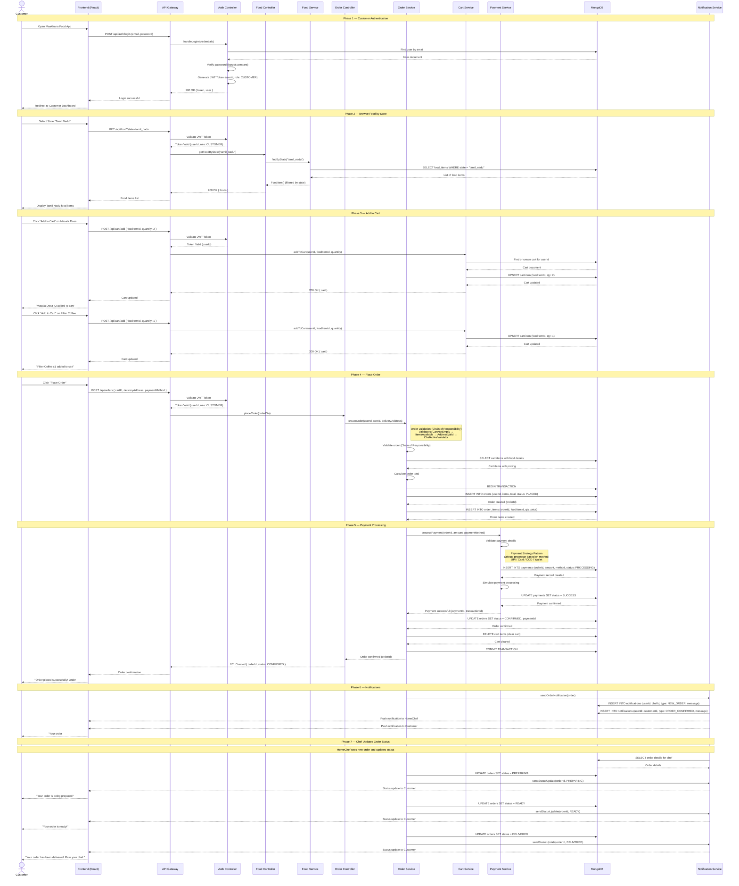

# Sequence Diagram — Maakhana Food

## Main Flow: End-to-End Order Placement (Customer Browses → Selects Food → Places Order → Payment → Notification)

This sequence diagram illustrates the complete lifecycle of an order — from a customer browsing food by state, adding items to cart, placing an order, through to payment processing and notification delivery.

---

---

## Flow Summary
| Phase                   | Description                                                                                                   | Key Patterns Used                   |
|-------------------------|---------------------------------------------------------------------------------------------------------------|-------------------------------------|
| **1. Authentication**   | Customer logs in with email/password. JWT token generated and returned for subsequent authenticated requests. | Singleton (DB connection)           |
| **2. Browse by State**  | Customer selects a state. Food items from that state are fetched and displayed dynamically.                   | Repository, Builder (query)         |
| **3. Add to Cart**      | Customer adds food items to their cart. Cart is persisted in the database per user.                           | Repository                          |
| **4. Place Order**      | Cart is converted to an order. Validated through a chain of validators. Order and items stored in DB.        | Chain of Responsibility, Factory    |
| **5. Payment**          | Payment processed based on selected method. Simulated payment gateway confirms transaction.                  | Strategy Pattern                    |
| **6. Notifications**    | Both chef and customer receive notifications about the new order and confirmation.                           | Observer Pattern                    |
| **7. Status Updates**   | Chef updates order status through lifecycle. Customer receives real-time status notifications.                | State Pattern, Observer             |
