```mermaid
graph TB
    subgraph Maakhana Food Platform
        UC1["Register / Login"]
        UC2["Select Region"]
        UC3["Browse Food by Region"]
        UC4["Browse Food Items"]
        UC5["Add to Cart"]
        UC6["Place Order"]
        UC7["View Orders"]
        UC8["Rate Chef"]
        UC9["View Order History"]
        UC10["Manage Profile"]
        UC11["Search Food"]
        UC12["Add Food Item"]
        UC13["Update Food Item"]
        UC14["Delete Food Item"]
        UC15["View Incoming Orders"]
        UC16["Update Order Status"]
        UC17["Manage Food Listings"]
        UC18["View Chef Dashboard"]
        UC19["Approve Chef"]
        UC20["Manage Users"]
        UC21["Monitor Orders"]
        UC22["View Platform Analytics"]
        UC23["Reject Chef"]
        UC24["Deactivate User"]
        UC25["Validate JWT Token"]
        UC28["Update Chef Profile"]
    end

    Customer((Customer))
    HomeChef((HomeChef))
    Admin((Admin))

    %% Customer use cases
    Customer --> UC1
    Customer --> UC2
    Customer --> UC3
    Customer --> UC4
    Customer --> UC5
    Customer --> UC6
    Customer --> UC7
    Customer --> UC8
    Customer --> UC9
    Customer --> UC10
    Customer --> UC11

    %% HomeChef use cases
    HomeChef --> UC1
    HomeChef --> UC12
    HomeChef --> UC13
    HomeChef --> UC14
    HomeChef --> UC15
    HomeChef --> UC16
    HomeChef --> UC17
    HomeChef --> UC18
    HomeChef --> UC28

    %% Admin use cases
    Admin --> UC1
    Admin --> UC19
    Admin --> UC20
    Admin --> UC21
    Admin --> UC22
    Admin --> UC23
    Admin --> UC24

    %% System-driven (internal triggers)
    UC6 -.->|triggers| UC25

    %% Include relationships
    UC2 -.->|includes| UC3
    UC3 -.->|includes| UC4
    UC4 -.->|extends| UC5
    UC5 -.->|extends| UC6
```

# Use Case Diagram — Maakhana Food

## Overview
This diagram shows all major use cases for the Maakhana Food platform, organized by the three primary actors: **Customer**, **HomeChef**, and **Admin**.

---

---

## Use Case Descriptions
| #    | Use Case              | Actors             | Description                                                                                   |
|------|-----------------------|--------------------|-----------------------------------------------------------------------------------------------|
| UC1  | Register / Login      | All                | Create account or authenticate with JWT. Role (Customer/HomeChef) assigned at registration.   |
| UC2  | Select Region          | Customer           | Choose an Indian region (e.g., Punjab, Tamil Nadu, West Bengal) to browse food from.           |
| UC3  | Browse Food by Region  | Customer           | View food items from the selected region, listed by home chefs native to that region.           |
| UC4  | Browse Food Items     | Customer           | View available food items listed by home chefs, filtered by region.                            |
| UC5  | Add to Cart           | Customer           | Add selected food items to the shopping cart with desired quantity.                            |
| UC6  | Place Order           | Customer           | Checkout the cart, provide delivery details, and confirm the order with simulated payment.     |
| UC7  | View Orders           | Customer           | View all current and past orders with their statuses.                                         |
| UC8  | Rate Chef             | Customer           | Submit a rating and written review for a chef after order delivery.                           |
| UC9  | View Order History    | Customer           | Browse detailed history of all completed orders.                                              |
| UC10 | Manage Profile        | Customer           | Update personal information, delivery address, and preferences.                               |
| UC11 | Search Food           | Customer           | Search food items by name, cuisine, or chef name across all regions.                           |
| UC12 | Add Food Item         | HomeChef           | Create a new food listing with name, description, price, image, and region.                    |
| UC13 | Update Food Item      | HomeChef           | Modify an existing food item's details, pricing, or availability.                             |
| UC14 | Delete Food Item      | HomeChef           | Remove a food item from the marketplace.                                                      |
| UC15 | View Incoming Orders  | HomeChef           | See all new and active orders placed by customers for the chef's food items.                  |
| UC16 | Update Order Status   | HomeChef           | Change order status through the lifecycle (Confirmed → Preparing → Ready → Delivered).        |
| UC17 | Manage Food Listings  | HomeChef           | Overview of all food items with quick actions (edit, delete, toggle availability).             |
| UC18 | View Chef Dashboard   | HomeChef           | Dashboard showing order summary, earnings, and food item stats.                               |
| UC19 | Approve Chef          | Admin              | Review and approve a new HomeChef registration to allow food listings.                        |
| UC20 | Manage Users          | Admin              | View, search, and manage all platform users across roles.                                     |
| UC21 | Monitor Orders        | Admin              | View all platform orders with filters by status, region, date, and chef.                       |
| UC22 | View Platform Analytics | Admin            | Dashboard with platform-wide metrics: total orders, revenue, active chefs, region-wise stats.  |
| UC23 | Reject Chef           | Admin              | Decline a HomeChef registration with a reason.                                                |
| UC24 | Deactivate User       | Admin              | Temporarily or permanently deactivate a user account.                                         |
| UC25 | Validate JWT Token    | System             | Authenticate and authorize requests using JWT middleware.                                     |
| UC28 | Update Chef Profile   | HomeChef           | Update chef-specific profile info: specialties, region, bio.                                   |
